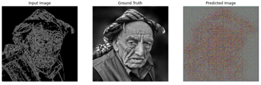
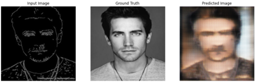
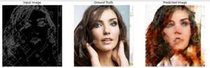
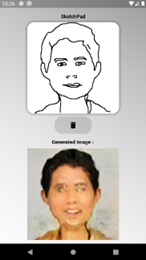

# Suspecto:  A Crime Detection System using NLP and cGANs

##  Overview

**Suspecto** is an AI-powered crime detection system that generates realistic human-like facial images based on vague or partial descriptions, such as those given by eyewitnesses. Combining the strengths of **Natural Language Processing (NLP)** and **Conditional Generative Adversarial Networks (cGANs)**, this project bridges the gap between language and visual representation in the realm of criminal investigation.

##  Motivation

In real-world crime investigations, eyewitnesses often provide imprecise or fragmented descriptions of suspects. Traditional sketch artists rely heavily on interpretation, which may introduce bias or inaccuracy. **Suspecto** aims to automate and enhance this process using AI, reducing human error and accelerating investigations.

##  Technologies Used

- **Natural Language Processing (NLP)** – for parsing and interpreting descriptive input.
- **Conditional GAN (cGAN)** – to generate human facial images based on features extracted from text.
- **PyTorch / TensorFlow** – for building and training deep learning models.
- **Spacy / NLTK / BERT** – for text preprocessing and semantic feature extraction.
- **OpenCV / Matplotlib** – for image processing and visualization.

##  Features

- 🧾 **Text-to-Face Generation**: Converts vague or detailed suspect descriptions into photo-realistic images.
- 🧠 **Deep NLP Understanding**: Extracts semantic features like age, gender, emotion, facial attributes from textual input.
- 🧬 **Conditional GAN Backbone**: Ensures generated faces align with the extracted features.
- 🧪 **Interactive Demo Interface**: Accepts natural language input and returns generated suspect images.

## Training Result 

### 🔹 Epoch 0

### 🔹 Epoch 1

### 🔹 Epoch 17

## Output

